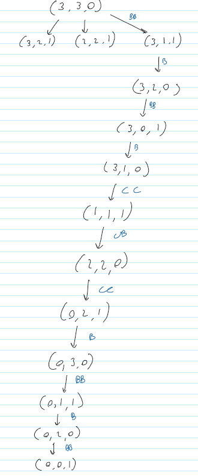

# Leonardo Ferrisi - Project 2: BORG

#### Solving the puzzle by hand:

### Solution (by Hand):
- Initial State: (3,3,0)
- Mov2Borgs: (3,1,1)
- MovBorg: (3,2,0)
- Mov2Borgs: (3,0,1)
- MovBorg: (3,1,0)
- Mov2Crew: (1,1,1)
- Mov1Crew1Borg: (2,2,0)
- Mov2Crew: (0,2,1)
- MovBorg: (0,3,0)
- Mov2Borgs: (0,1,1)
- MovBorg: (0,2,0)
- Mov2Borgs: (0,0,1) <--- Goal State

*As you can see, my by hand solution actually takes more steps than the one the search algorithm found* 

###### People likely have a hard time solving this puzzle as for each operation their are countless other operations that can be made from there, most of which may not reach the goal state

 
 

## Part 2:

#### A Summary: 

| Algorithm       |     Problem    | Time Elapsed (s) | Steps Taken |     Improvement       |
|-----------------|:--------------:|-----------------:|------------:|----------------------:|
| improved search |  borg_puzzle   |        0.001     |      9      | roughly 0.009s faster |
| search          |  borg_puzzle   |        0.01      |      9      |           x           |
| improved search |  pitcher       |        0.001     |      6      | roughly 0.299s faster |
| search          |  pitcher       |        0.3       |      6      |           x           |

##### Analysis:
All in all both search methods, when a solution is found, visited the same amount of nodes. 
The Graph - Search implementation used in improvedSearch was substantially faster however

BorgPuzzle: improvedSearch was 0.009 seconds faster on average compared to search for borg_puzzle.py
Pitcher: improvedSearch was 0.311 seconds faster on average compared to search for pitcher.py

